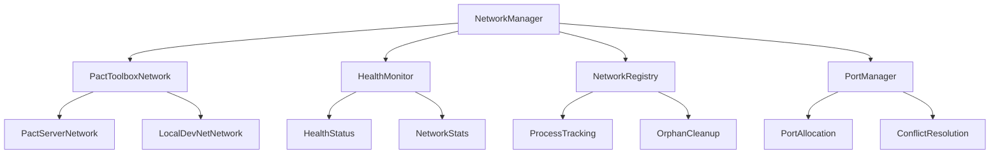

# Network Package

The `@pact-toolbox/network` package provides comprehensive network management capabilities for Pact development environments, including lifecycle management, health monitoring, discovery, and registry services.

## Overview

The network package is the core infrastructure for managing local Pact networks in development. It provides:

- **Docker-Based Networks**: Container orchestration for DevNet and services
- **Unified Network Management**: Consistent API across all environments
- **Health Monitoring**: Continuous network health checks and statistics
- **Network Discovery**: Automatic detection of running networks
- **Service Management**: Coordinate multiple services (Pact, mining, wallet)
- **Port Management**: Thread-safe port allocation and conflict resolution
- **Graceful Shutdown**: Proper cleanup of containers and processes

## Architecture

### Core Components



### Network Types

- **DevNet**: Full Kadena blockchain simulation with Docker
  - 10 chains (configurable)
  - Automatic mining
  - Coin contract pre-deployed
  - Gas station support
- **Minimal**: Lightweight single-chain setup
  - Fast startup
  - Ideal for unit testing
- **Compact**: 5-chain balanced configuration

## Quick Start

### Basic Usage

```typescript
import { NetworkManager } from "@pact-toolbox/network";
import { resolveConfig } from "@pact-toolbox/config";

// Create network manager for your bundler
const config = await resolveConfig();
const manager = NetworkManager.forBundler("vite", {
  config,
  mode: "development",
  autoStart: true,
});

// Start the network
await manager.start();

// Check health
const isHealthy = await manager.isHealthy();
console.log("Network healthy:", isHealthy);

// Stop when done
await manager.stop();
```

### Bundler Integration

The network package integrates seamlessly with all major bundlers:

```typescript
// Vite Plugin
import { pactToolbox } from "@pact-toolbox/unplugin/vite";

export default {
  plugins: [
    pactToolbox({
      // Network automatically managed
    }),
  ],
};
```

## API Reference

### NetworkManager

The main interface for network lifecycle management.

#### Constructor Options

```typescript
interface NetworkManagerOptions {
  config: PactToolboxConfigObj;
  logger?: Logger;
  spinner?: Spinner;
  mode?: "development" | "production";
  autoStart?: boolean;
  setupSignalHandlers?: boolean;
  conflictStrategy?: "error" | "ignore" | "replace";
  shutdownTimeout?: number;
}
```

#### Methods

- `start(): Promise<void>` - Start the network
- `stop(): Promise<void>` - Stop the network with cleanup
- `restart(): Promise<void>` - Restart the network
- `getState(): NetworkManagerState` - Get current state
- `isHealthy(): Promise<boolean>` - Check network health
- `getHealthStatus(): HealthStatus | null` - Get detailed health info
- `getNetworkStats(): NetworkStats | null` - Get network statistics

#### Factory Method

```typescript
NetworkManager.forBundler(
  bundler: "vite" | "webpack" | "next" | "rsbuild" | "rollup" | "esbuild",
  options: NetworkManagerOptions
): NetworkManager
```

### Network Discovery

Find running networks across different sources:

```typescript
import { discoverNetworks } from "@pact-toolbox/network";

const networks = await discoverNetworks({
  includeStopped: false,
  scanPorts: true,
  portRange: { start: 8080, end: 8090 },
});

console.log("Found networks:", networks);
```

### Health Monitoring

Monitor network health continuously:

```typescript
import { getHealthMonitor } from "@pact-toolbox/network";

const monitor = getHealthMonitor({
  enableContinuousMonitoring: true,
  checkInterval: 5000,
  onHealthChange: (networkId, status) => {
    console.log(`Network ${networkId}: ${status.status}`);
  },
});

// Add network to monitoring
monitor.addNetwork(networkConfig);
monitor.startMonitoring(networkConfig);
```

### Docker Integration

The network package uses Docker for reliable, isolated development environments:

```typescript
import { DockerNetwork } from "@pact-toolbox/network";

// Create Docker-based DevNet
const network = new DockerNetwork({
  preset: "devnet", // or "minimal", "compact"
  chainIds: ["0", "1", "2", "3", "4"], // Custom chains
  miningDelay: 5, // Seconds between blocks
  persist: true, // Keep data between restarts
  services: {
    pact: true,
    mining: true,
    wallet: true // Enable dev wallet
  }
});

// Start network
await network.start();

// Check container status
const status = await network.getContainerStatus();
console.log("Containers:", status);

// Stop and clean up
await network.stop({ removeVolumes: true });
```

#### Docker Configuration

```typescript
interface DockerNetworkConfig {
  // Network preset
  preset?: "devnet" | "minimal" | "compact" | "custom";
  
  // Custom configuration
  chainIds?: string[];
  miningDelay?: number;
  
  // Container settings
  image?: string; // Custom Pact image
  volumes?: boolean; // Persist data
  network?: string; // Docker network name
  
  // Services
  services?: {
    pact?: boolean;
    mining?: boolean;
    wallet?: boolean;
    gasStation?: boolean;
  };
  
  // Resource limits
  resources?: {
    cpuLimit?: string; // e.g., "0.5"
    memoryLimit?: string; // e.g., "512m"
  };
}
```

### Port Management

Thread-safe port allocation:

```typescript
import { portManager } from "@pact-toolbox/network";

// Allocate single port
const port = await portManager.allocatePort();

// Allocate multiple sequential ports
const ports = await portManager.allocateMultiplePorts(3);

// Release when done
portManager.releasePort(port);
portManager.releaseMultiplePorts(ports);
```

### Registry Management

Persistent process tracking:

```typescript
import { networkRegistry } from "@pact-toolbox/network";

// Get running networks
const running = await networkRegistry.getRunning();

// Clean up orphaned processes
await networkRegistry.cleanupOrphaned();

// Perform full cleanup
import { performFullCleanup } from "@pact-toolbox/network";
await performFullCleanup({ force: true });
```

## Configuration

### Network Configuration

```typescript
// pact-toolbox.config.ts
export default {
  defaultNetwork: "local",
  networks: {
    local: {
      type: "pact-server",
      networkId: "my-local-network",
      name: "Local Development",
      serverConfig: {
        port: 8080,
        verbose: true,
      },
    },
    devnet: {
      type: "devnet",
      networkId: "my-devnet",
      name: "DevNet",
      containerConfig: {
        rpcPort: 8545,
        p2pPort: 30303,
      },
    },
  },
};
```

### Health Monitoring Configuration

```typescript
const monitor = getHealthMonitor({
  enableContinuousMonitoring: true,
  checkInterval: 5000, // 5 seconds
  timeout: 10000, // 10 seconds
  maxConsecutiveFailures: 3,
  retryInterval: 1000,
  onHealthChange: (networkId, status) => {
    // Handle health changes
  },
  onUnhealthy: (networkId, result) => {
    // Handle unhealthy networks
  },
});
```

## Bundler-Specific Behavior

### Next.js

- Uses process.env flags for persistence across hot reloads
- Automatically sets up signal handlers
- Uses "ignore" conflict strategy to prevent multiple instances

### Vite

- Hot reload integration with network preservation
- Development mode optimizations
- Fast restart capabilities

### Webpack/Rsbuild

- Build lifecycle integration
- Production mode compatibility
- Bundle optimization considerations

## Troubleshooting

### Common Issues

#### Port Conflicts

```typescript
// Check for port conflicts
const conflicts = await portManager.findConflicts([8080, 8081]);
if (conflicts.length > 0) {
  console.log("Port conflicts:", conflicts);
}
```

#### Orphaned Processes

```typescript
// Clean up orphaned networks
await networkRegistry.cleanupOrphaned();

// Force cleanup with retries
await performFullCleanup({
  force: true,
  maxRetries: 3,
});
```

#### Health Check Failures

```typescript
// Check detailed health status
const status = manager.getHealthStatus();
if (status?.status === "unhealthy") {
  console.log("Network issue:", status.error);
  console.log("Last successful check:", status.lastCheckTime);
}
```

### Debug Mode

Enable debug logging for detailed network information:

```bash
LOG_LEVEL=debug pact-toolbox dev
```

### Network Inspector

Use the discovery API to inspect network state:

```typescript
import { discoverNetworks, getServerIdentifier } from "@pact-toolbox/network";

// Discover all networks
const networks = await discoverNetworks({
  scanPorts: true,
  portRange: { start: 8000, end: 9000 },
});

// Identify server types
const identifier = getServerIdentifier();
for (const network of networks) {
  const info = await identifier.identifyServer(network.port);
  console.log(`Port ${network.port}: ${info.type} (${info.confidence})`);
}
```

## Best Practices

### Development Workflow

1. **Single Network**: Use one network per project in development
2. **Health Monitoring**: Enable continuous monitoring in dev mode
3. **Graceful Shutdown**: Always use proper cleanup mechanisms
4. **Port Management**: Let the system allocate ports automatically

### Production Considerations

1. **No Auto-Start**: Disable auto-start in production builds
2. **External Networks**: Use external network configurations
3. **Monitoring**: Implement external health checks
4. **Security**: Never expose development networks publicly

### Error Handling

```typescript
try {
  await manager.start();
} catch (error) {
  if (error.message.includes("port conflict")) {
    // Handle port conflicts
    await manager.stop();
    await manager.start();
  } else {
    // Handle other errors
    console.error("Network error:", error);
  }
}
```

## Integration Examples

### With Testing

```typescript
import { createTestEnv } from "@pact-toolbox/test";

const testEnv = await createTestEnv({
  network: "local",
  autoCleanup: true,
});

// Network automatically managed for tests
```

### With CI/CD

```typescript
// ci-test.ts
import { NetworkManager } from "@pact-toolbox/network";

// Disable signal handlers in CI
const manager = NetworkManager.forBundler("vite", {
  config,
  setupSignalHandlers: false,
  conflictStrategy: "replace",
});
```

For more examples and advanced usage, see the [tutorials section](/docs/tutorials) and [package examples](https://github.com/kadena/pact-toolbox/tree/main/examples).